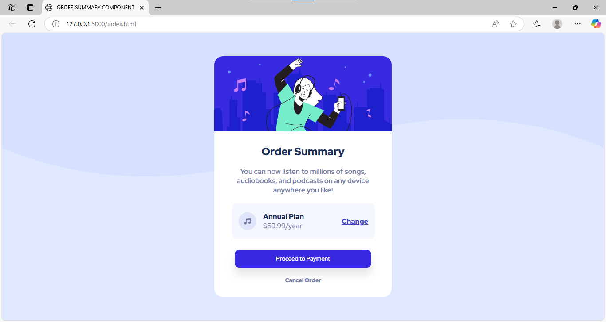

## Overview
This is a solution to the [Order Summary component challenge on Frontend Mentor](https://www.frontendmentor.io/challenges/order-summary-component-QlPmajDUj). Frontend Mentor challenges help you improve your coding skills by building realistic projects. 

## Features
- Background pattern with responsive sizing and soft colors
- Clean card layout with rounded corners and shadow
- Red Hat Display font with multiple weights for sleek text
- Flexible music plan section with icon, price, and "Change" link
- Bold "Proceed to Payment" button with hover effect
- Minimal "Cancel Order" text link
- Fully responsive with flexible dimensions and layout

### Screenshot

### Live site
https://echo-script0.github.io/Product-preview-card-component/

### Built with

- HTML5

- CSS3 (Flexbox, HSL colors)

- Responsive Design Principles

## Author
- Aisha Adeyemo
- Frontend Mentor - (https://www.frontendmentor.io/profile/echo-script0)

